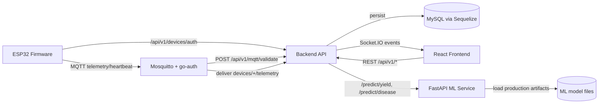

# FarmCast: An End-to-End IoT-Assisted Smart Agriculture Platform

## Abstract
FarmCast is a multi-component precision agriculture system that combines embedded sensing, secure device identity, real-time telemetry, machine learning inference, and a role-based web dashboard. This document presents a research-paper-style technical study of the repository as implemented in code. The platform consists of five interacting subsystems: an ESP32 firmware runtime, an MQTT broker and authorization boundary, a Node.js backend API with security and ownership enforcement, a React frontend workspace, and a Python ML service supporting model training and production inference. The analysis shows that FarmCast is architected around explicit trust boundaries, deterministic control flows, and lifecycle safety mechanisms such as secure two-stage device deletion, broker-side ACL validation, and retention-based data hygiene jobs.

## Keywords
IoT agriculture, ESP32, MQTT, secure provisioning, device lifecycle, FastAPI, LightGBM, TensorFlow, React dashboard, telemetry analytics.

## 1. Introduction
Modern farm monitoring systems require coordinated behavior across constrained edge devices, cloud/backend services, and model inference pipelines. FarmCast addresses this by implementing:

1. Hardware telemetry capture from field devices.
2. Secure authentication and ownership binding from device to user.
3. Real-time ingestion and alerting.
4. Yield and disease prediction services.
5. Operational user/admin workflows in a web interface.

This paper documents how the application works end-to-end, based on direct source-code analysis of all top-level project directories under `FC/`.

## 2. Scope and Method
### 2.1 Scope
All primary directories were studied:

1. `backend/`
2. `frontend/`
3. `firmware/`
4. `farmcast-ml/`
5. `docker/`
6. `mqtt/`
7. Root-level documents and logs
8. Runtime virtual environments (`.venv`, `.venv-ml`) at inventory level

### 2.2 Method
The study used static code inspection of:

1. Runtime entry points.
2. Route/controller/service/model flows.
3. Firmware state and service loops.
4. ML training/inference/registry modules.
5. Broker config and callback authorization.
6. Existing automated tests.

No architectural assumptions were made beyond what code and configs enforce.

## 3. Repository Cartography
| Directory | Primary Role |
|---|---|
| `backend/` | REST API, auth/RBAC, device ownership, telemetry ingestion, alerting, admin/chat/community workflows |
| `frontend/` | React dashboard for devices, predictions, community, profile, and admin operations |
| `firmware/` | ESP32 runtime: provisioning, WiFi/auth/MQTT loops, telemetry, heartbeat, OTA, reset flows |
| `farmcast-ml/` | FastAPI ML service, feature engineering, training/retraining pipelines, model registry and monitoring |
| `docker/` | Mosquitto + go-auth compose/config for broker deployment |
| `mqtt/` | Broker runtime config/data/log mounts |
| `.venv`, `.venv-ml` | Local Python runtime environments |
| Root files (`README.md`, logs) | Project structure reference and run-time diagnostic artifacts |

## 4. System Architecture
### 4.1 Logical Layering
FarmCast follows a layered architecture:

1. Edge Layer: ESP32 firmware acquires sensor/GPS/battery data and publishes telemetry.
2. Transport Layer: MQTT broker mediates pub/sub with callback-based auth/ACL.
3. Application Layer: Express backend enforces user/device boundaries, persists data, emits sockets, orchestrates ML.
4. Intelligence Layer: Python ML API provides yield/price/disease prediction and model lifecycle.
5. Presentation Layer: React frontend exposes operational workflows to users and admins.

### 4.2 Runtime Topology

### 4.3 Control-Plane Characteristics
1. Identity decoupling: user JWTs and device JWTs use separate secrets.
2. Ownership-first semantics: device and data access remains user-scoped, including admin context for non-admin resources.
3. Fail-safe behavior: offline monitors, token refresh fallback, and secure deletion state transitions.

## 5. Backend System (Node.js, Express, Sequelize)
### 5.1 Startup Sequence
`src/server.js` performs deterministic startup:

1. Validate environment (`src/config/env.js`).
2. Connect database.
3. Create HTTP server and initialize Socket.IO.
4. Start listening.
5. Connect MQTT client and subscribe to device topics.
6. Start retention and offline-monitor schedulers.

Graceful shutdown closes jobs, sockets, HTTP server, MQTT, and DB in reverse order.

### 5.2 API Surface
Versioned APIs are mounted as `/api/v1/*` with modules:

1. `auth`: register/login/refresh/logout.
2. `users`: profile fetch/update/upload/delete.
3. `devices`: auth/provision/CRUD/live/sync/secure-delete.
4. `soil`: ingest/history/latest.
5. `predictors`: yield run, disease upload, recommendations, email.
6. `admin`: overview, user listing, user prediction history, admin delete.
7. `chat`: contacts/messages/send/delete-thread.
8. `community`: post list/create/delete.
9. `mqtt`: broker validation callback.

### 5.3 Security and Isolation Model
Core controls:

1. Helmet + strict CORS + global and route-specific rate limiting.
2. Correlation IDs per request.
3. JWT auth middleware for users.
4. RBAC checks for `user` and `admin`.
5. Device auth path with hashed secrets (bcrypt), constant-time comparisons, and device JWT issuance.
6. MQTT validation service to authorize CONNECT, ACL, and superuser checks.
7. Audit logging with secret/token/password metadata redaction.

### 5.4 Device Lifecycle Semantics
#### Provisioning
1. User invokes `/devices/provision`.
2. Backend allocates canonical device code `fc-XXXXXXXX`.
3. Backend generates one-time plaintext device secret; only hash is stored.
4. Provisioning payload includes device id, secret, and reachable backend/MQTT coordinates for firmware.

#### Runtime Update
1. Device metadata updates are owner-scoped.
2. WiFi credential update is published to `devices/{deviceCode}/wifi/update` via MQTT command topic.

#### Secure Deletion
Hard delete is blocked by design.

1. Stage 1: `DELETE /devices/:id/pre-delete` sets pending-delete flags.
2. Stage 2: `POST /devices/:id/finalize-delete` unbinds user, clears secret hash, marks inactive, and clears retained MQTT topics.
3. USB confirmation is enforced on frontend/firmware flow before stage 2.

### 5.5 Telemetry Ingestion Pipeline
Backend subscriber consumes:

1. `devices/+/telemetry`
2. `devices/+/heartbeat`
3. `devices/+/system/reset`

Validation gates include:

1. strict topic regex (`fc-[A-Z0-9]{8}`),
2. payload-topic device consistency,
3. `gpsValid === true`,
4. `soilValid === true`,
5. numeric bounds for moisture/temperature/latitude/longitude,
6. explicit rejection of `0,0` coordinates.

On valid telemetry:

1. persist `SoilRecord`,
2. set device online + last-seen + geo,
3. evaluate moisture/offline alerts,
4. emit real-time socket events to owning user room.

### 5.6 Alerts, Retention, and Audit
Alert types:

1. `MOISTURE_LOW`
2. `MOISTURE_HIGH`
3. `DEVICE_OFFLINE`

Schedulers:

1. prediction-history retention cleanup (default short retention window),
2. community-post retention and image cleanup,
3. offline device scanner creating offline alerts and audit events.

### 5.7 Data Model
Primary entities:

1. `User`
2. `Device`
3. `SoilRecord`
4. `RefreshToken`
5. `PredictionHistory`
6. `ChatMessage`
7. `CommunityPost`
8. `Crop`
9. `Alert`
10. `AuditLog`

Migration set `001`-`016` establishes schema evolution including geospatial constraints, device secrets, audit logging, and secure-delete columns.

## 6. Frontend System (React, Vite)
### 6.1 Application Structure
Entry and shell:

1. `main.jsx` and provider tree (`Auth`, `Socket`, `View` contexts).
2. Router with public-only auth pages and protected dashboard route.
3. Workspace orchestrator selects active view: device, predictor, community, profile, admin.

### 6.2 API Reliability Features
`src/services/api.js` includes:

1. JWT header injection.
2. Proactive refresh before access-token expiry.
3. Retry-once for transient upstream failures (`502/503/504`).
4. Retry-after-refresh for `401`.
5. Correlation-ID generation.

### 6.3 User-Facing Operational Views
1. Device View: device list/select, live telemetry cards, map, socket updates, secure delete modal flow.
2. Predictor View: yield and disease modes, normalized result rendering, email and print actions.
3. Profile View: profile update/image upload, account actions, USB provisioning wizard, device management.
4. Community View: feed create/delete, image preview/download, inline user messaging.
5. Admin View: system overview health and user management panel.

### 6.4 USB Provisioning and Secure Delete (Web Serial)
`deviceProvisioning.js` handles:

1. serial port request/open/line I/O.
2. firmware handshake via `GET_FIRMWARE_INFO`.
3. provisioning payload transfer and ack handling.
4. online polling until backend confirms device live status.
5. secure delete orchestration: pre-delete API -> USB `FACTORY_RESET` -> finalize-delete API.

## 7. Firmware Runtime (ESP32, PlatformIO)
### 7.1 Core State Machine
Lifecycle states:

1. `PROVISIONING`
2. `CONNECTING_WIFI`
3. `AUTHENTICATING`
4. `ONLINE`

`DeviceContext` orchestrates services and transitions.

### 7.2 Provisioning Channel
Serial commands:

1. `GET_FIRMWARE_INFO`
2. JSON provisioning payload with `deviceId`, WiFi, `deviceSecret`, optional `apiBaseUrl`, `mqttHost`
3. `FACTORY_RESET`

Provisioning data is persisted in NVS via `DeviceIdentityService`.

### 7.3 Authentication and MQTT Sessioning
1. Firmware authenticates via `POST /api/v1/devices/auth`.
2. Receives short-lived device JWT.
3. Uses device id as MQTT username and JWT as password.
4. Publishes telemetry and heartbeat only when runtime validity conditions pass.

Repeated auth-required responses can trigger local factory reset signaling for recovery.

### 7.4 Sensor and GPS Quality Gates
Soil sensor service rejects:

1. floating ADC conditions,
2. noisy/unreliable raw spans,
3. invalid temperature conversions.

GPS service enforces:

1. minimum satellites,
2. HDOP threshold,
3. warmup and stability cycles,
4. timeout-based fix loss handling.

### 7.5 OTA
OTA commands are consumed from MQTT, then:

1. version gate ensures only newer firmware applies,
2. HTTPS download,
3. SHA256 checksum verification,
4. flash write + finish check,
5. delayed reboot.

### 7.6 Security-Relevant Reset Behavior
1. USB `FACTORY_RESET` clears provisioning materials and returns to provisioning mode.
2. Full factory reset path can clear all identity data and publish reset event when connected.

## 8. ML Platform (FastAPI + Training Pipelines)
### 8.1 Online Inference API
Endpoints:

1. `GET /health`
2. `POST /predict/yield`
3. `POST /predict/price`
4. `POST /predict/disease`

API-key guard supports `X-API-Key` and bearer fallback.

### 8.2 Inference Engines
1. Yield path uses geo-aware feature build + model metadata checks + unit conversion logic in `src/inference/yield_predictor.py`.
2. Price path uses lazy-loaded LightGBM predictor + preprocessor.
3. Disease path uses MobileNetV3 preprocessing and top-k class probabilities with class map decoding.

### 8.3 Data and Feature Engineering
1. Schema-validated ingestion for yield and price datasets.
2. Leakage prevention checks.
3. Seasonality and lag/rolling features for price.
4. Weather feature fallback hierarchy by district/state/season/year.

### 8.4 Training, Registry, Promotion
Training pipeline supports `yield`, `price`, `disease`, or `all`:

1. dataset load + validation,
2. feature engineering,
3. model training (LightGBM or TensorFlow MobileNetV3),
4. threshold enforcement,
5. artifact staging and metadata writing,
6. latency benchmarking,
7. candidate registration,
8. objective-based promotion to production artifacts.

Retraining can skip unchanged dataset hashes and rerun only when required.

### 8.5 Monitoring Utilities
1. PSI drift detection (`stable`, `warning`, `alert`).
2. Rolling MAE monitor with alert thresholding.
3. Alert event builders for drift and performance breaches.

## 9. MQTT and Broker Boundary
### 9.1 Broker Deployment
Mosquitto-go-auth is deployed through `docker/docker-compose.mqtt.yml`.

### 9.2 Dynamic Validation
Broker callbacks to backend:

1. `POST /api/v1/mqtt/validate`

Validation checks include:

1. device JWT signature/issuer/audience/expiry,
2. username-device binding,
3. topic-device binding,
4. wildcard denial for device topics,
5. session revalidation against current device ownership/status.

## 10. End-to-End Workflow Narratives
### 10.1 User Login and Session Continuity
1. User authenticates via backend auth module.
2. Frontend stores access + refresh tokens.
3. API layer silently refreshes tokens when close to expiry.

### 10.2 Device Onboarding
1. User opens USB provisioning wizard.
2. Firmware handshake validates reachable serial link.
3. Backend issues device code + secret.
4. Firmware persists credentials and reboots.
5. Device authenticates cloud-side and begins MQTT operation.

### 10.3 Telemetry to Alert
1. Firmware publishes validated telemetry.
2. Backend ingests and stores.
3. Threshold resolver creates/resolves alerts.
4. Socket.IO broadcasts updates to dashboard.

### 10.4 Prediction and Report Delivery
1. Frontend submits yield request or disease image.
2. Backend orchestrates ML call and response normalization.
3. Prediction history is persisted.
4. Optional transactional email report is generated and sent via SMTP.

### 10.5 Secure Device Deletion
1. Pre-delete API marks pending.
2. USB factory reset command clears firmware provisioning data.
3. Finalize-delete API unbinds server-side ownership and secret material.

## 11. Trust Boundaries and Security Posture
Primary trust boundaries:

1. Browser <-> Backend API (user JWT boundary).
2. Device <-> Backend auth endpoint (device secret boundary).
3. Device <-> Broker (device JWT + topic ACL boundary).
4. Broker <-> Backend callback (authorization oracle boundary).
5. Backend <-> ML service (API key/JWT service-to-service boundary).

Implemented protections:

1. Separate user and device auth domains.
2. Ownership checks at service layer for user-scoped resources.
3. Structured audit logging for sensitive lifecycle events.
4. Strict telemetry payload validation.
5. Rate limits for public and high-volume endpoints.

## 12. Operations and Reproducibility
### 12.1 Minimal Local Startup Order
1. Start database.
2. Start backend (`npm run migrate`, optional seed, then `npm run dev`).
3. Start broker (`docker compose -f docker/docker-compose.mqtt.yml up -d`).
4. Start ML API (`uvicorn src.api.ml_service:app --host 0.0.0.0 --port 5001` or configured port).
5. Start frontend (`npm run dev`).

### 12.2 Runtime Observability
1. Backend structured logging + correlation ids.
2. MQTT message handling logs and security events.
3. Firmware serial logs for lifecycle and telemetry status.
4. ML pipeline/file logs and JSON event logs.

## 13. Test Evidence and Quality Posture
### 13.1 Backend Tests
Integration test (`tests/integration/security-boundary.test.js`) validates:

1. provisioning ownership binding,
2. device auth token issuance and invalid-secret rejection,
3. status access isolation by owner,
4. MQTT validate behavior for expired JWT and cross-device topic denial.

### 13.2 ML Tests
Pytest suite covers:

1. API endpoint behavior with mocked pipeline.
2. split/threshold logic for yield and price.
3. disease dataset builder corruption checks.
4. registry objective logic and promotion semantics.

### 13.3 Current Gap
No automated frontend test suite is present in this repository snapshot.

## 14. Identified Risks and Inconsistencies
1. Dual yield inference paths in ML (`src/inference/yield_predictor.py` and pipeline predictor class) indicate architectural drift risk.
2. ML exposes price prediction API but backend predictor orchestration currently uses yield and disease only.
3. Some ML tests and sample frames appear misaligned with current schema contracts, suggesting stale test fixtures.
4. Root-level README tree is partially stale relative to actual directory evolution.
5. `mqtt/config/aclfile` uses topic patterns different from active `devices/...` topic family, indicating potential stale config copy.
6. Legacy cleanup job references old soil timestamp semantics and is disabled; if enabled without update, behavior may be incorrect.

## 15. Conclusion
FarmCast is a production-oriented smart agriculture platform with a strong emphasis on lifecycle correctness, ownership isolation, and secure device-cloud interaction. Its most mature qualities are:

1. explicit device identity and secure deletion workflow,
2. broker-level authorization integrated with backend state,
3. resilient dashboard transport behavior,
4. deterministic ML training and registry/promotion controls.

The system is already capable of full operational workflows from USB provisioning through live telemetry and prediction delivery. The next maturity step is consolidation of duplicated ML inference paths and expansion of automated end-to-end tests (especially frontend and full-stack integration).

---

## Appendix A: High-Level API Index
### Auth
1. `POST /api/v1/auth/register`
2. `POST /api/v1/auth/login`
3. `POST /api/v1/auth/refresh`
4. `POST /api/v1/auth/logout`

### Users
1. `GET /api/v1/users/me`
2. `PUT /api/v1/users/me`
3. `POST /api/v1/users/me/upload`
4. `DELETE /api/v1/users/me`

### Devices
1. `POST /api/v1/devices/auth`
2. `GET /api/v1/devices`
3. `GET /api/v1/devices/:id`
4. `GET /api/v1/devices/:id/status`
5. `POST /api/v1/devices`
6. `POST /api/v1/devices/provision`
7. `PUT /api/v1/devices/:id`
8. `DELETE /api/v1/devices/:id/pre-delete`
9. `POST /api/v1/devices/:id/finalize-delete`
10. `DELETE /api/v1/devices/:id` (blocked compatibility endpoint)
11. `GET /api/v1/devices/:id/live`
12. `PATCH /api/v1/devices/sync/:id`

### Soil
1. `POST /api/v1/soil`
2. `GET /api/v1/soil/history`
3. `GET /api/v1/soil/latest/:deviceId`

### Predictors
1. `POST /api/v1/predictors/run`
2. `POST /api/v1/predictors/fertilizer`
3. `POST /api/v1/predictors/water`
4. `POST /api/v1/predictors/yield`
5. `POST /api/v1/predictors/upload`
6. `POST /api/v1/predictors/mail`

### Admin
1. `GET /api/v1/admin/overview`
2. `GET /api/v1/admin/users`
3. `GET /api/v1/admin/users/:userId/predictions`
4. `DELETE /api/v1/admin/users/:userId`

### Chat
1. `GET /api/v1/chat/contacts`
2. `GET /api/v1/chat/messages`
3. `POST /api/v1/chat/messages`
4. `DELETE /api/v1/chat/threads/:withUserId`

### Community
1. `GET /api/v1/community/posts`
2. `POST /api/v1/community/posts`
3. `DELETE /api/v1/community/posts/:postId`

### MQTT Broker Callback
1. `POST /api/v1/mqtt/validate`
2. `POST /api/v1/mqtt/validate.`

### COMMANDS
npx sequelize-cli db:migrate
npx sequelize-cli db:seed:all

uvicorn src.api.ml_service:app --host 0.0.0.0 --port 5001

pip install -r requirements-ml.txt

pio run -t clean
pio run --target erase
pio run -t upload
pio run --target upload
pio device monitor
---

Prepared from repository source inspection on **March 4, 2026**.
