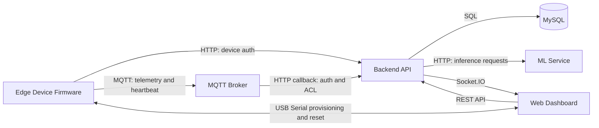

# Intelligent IoT Monitoring and AI Prediction Platform

## 1. Overview
This repository contains a distributed system for field telemetry collection, secure device lifecycle management, analytics, and predictive inference.

System boundary:
- In scope: edge firmware, MQTT messaging boundary, backend API, machine learning service, web dashboard, and local deployment assets.
- Out of scope: cloud resource provisioning templates, managed database provisioning, and CI/CD workflows.

Implementation profile:
- Backend API: Node.js, Express, Sequelize, MySQL, Socket.IO.
- Frontend: React, Vite, Axios, Socket.IO client.
- ML service: Python, FastAPI, LightGBM, TensorFlow, scikit-learn.
- Firmware: ESP32 (Arduino framework via PlatformIO), MQTT, HTTP, OTA.
- Messaging infrastructure: Mosquitto with go-auth HTTP callback integration.

## 2. System Capabilities
- Secure hardware onboarding with one-time device secrets and short-lived device JWTs.
- Telemetry ingestion from edge devices over MQTT with payload validation and ownership enforcement.
- Real-time device and alert updates to web clients through WebSocket channels.
- Soil analytics views and recommendation generation for fertilizer and water guidance.
- Yield and disease prediction orchestration through a dedicated ML inference service.
- Role-aware operations for standard users and administrators.
- Two-stage secure device deletion with physical reset confirmation flow.
- Background retention and hygiene jobs for prediction history, community posts, and offline detection.

## 3. System Architecture


Primary communication methods:
- Firmware -> backend: HTTP (`/api/v1/devices/auth`) for token acquisition.
- Firmware -> broker: MQTT publish/subscribe on per-device topics.
- Broker -> backend: HTTP callback (`/api/v1/mqtt/validate`) for connect and ACL decisions.
- Frontend -> backend: REST API (`/api/v1/*`) for all application operations.
- Backend -> frontend: Socket.IO events (`device:update`, `alert:new`, `alert:resolved`).
- Backend -> ML service: HTTP inference and health calls.
- Backend -> SMTP server: transactional email delivery.
- Frontend -> firmware: Web Serial API for provisioning and secure delete orchestration.

## 4. Component Architecture
### Edge Firmware (ESP32)
- Responsibility: boots device services, manages lifecycle states (`PROVISIONING`, `CONNECTING_WIFI`, `AUTHENTICATING`, `ONLINE`), publishes telemetry/heartbeat, processes OTA and Wi-Fi update commands.
- Interactions: authenticates to backend over HTTP, connects to MQTT broker with device JWT, accepts USB serial commands for provisioning/reset.
- Technologies: Arduino framework, PubSubClient, TinyGPS++, ArduinoJson, ESP32 NVS storage.
- Operational considerations: local backoff and reconnect logic, watchdog feeds, sensor quality gates, optional deep sleep, factory reset pathways.

### Messaging Layer (MQTT Broker)
- Responsibility: enforces authentication and topic-level authorization before message routing.
- Interactions: receives device MQTT sessions, invokes backend callback endpoint for CONNECT and ACL checks.
- Technologies: Mosquitto + go-auth plugin, Docker Compose.
- Operational considerations: callback dependency on backend reachability, no auth cache for immediate JWT expiry enforcement.

### Backend API Layer
- Responsibility: system control plane for auth, RBAC, device/domain APIs, MQTT ingestion handling, alert generation, audit logging, and ML orchestration.
- Interactions: subscribes to broker telemetry topics, persists to MySQL, calls ML inference APIs, emits Socket.IO events to user rooms.
- Technologies: Express, Sequelize, MySQL driver, Socket.IO, JWT, Joi validation, nodemailer.
- Operational considerations: strict startup sequence (DB -> HTTP/Socket -> MQTT -> jobs), graceful shutdown handling, structured correlation-aware logs.

### Machine Learning Layer
- Responsibility: serves inference endpoints and maintains model lifecycle workflows (training, retraining, registry, promotion).
- Interactions: receives inference requests from backend only, loads production model artifacts from local model store.
- Technologies: FastAPI, LightGBM, TensorFlow/Keras, scikit-learn, joblib, YAML-driven configuration.
- Operational considerations: API-key guarded endpoints, deterministic training controls, threshold-based model acceptance and promotion.

### Presentation Layer (Web Dashboard)
- Responsibility: user/admin interface for monitoring, prediction operations, profile/device management, community and chat workflows.
- Interactions: consumes REST APIs and Socket.IO events; performs Web Serial provisioning and reset command flows for edge devices.
- Technologies: React, Vite, Axios, Socket.IO client, Leaflet.
- Operational considerations: token refresh and retry interceptors, periodic polling for selected views, protected routing and role-gated view state.

### Data and State Layer
- Responsibility: persists identity, telemetry, alerts, prediction history, chat, community posts, and audit records.
- Interactions: written and queried by backend services and jobs.
- Technologies: MySQL (via Sequelize models/migrations), local file storage for uploads and ML artifacts.
- Operational considerations: retention cleanup jobs, soft-delete/hard-delete mix by domain, index-based query optimization in migration set.

## 5. Data Flow
### Telemetry Flow
1. Firmware reads soil, GPS, and battery values.
2. Firmware validates sensor and coordinate quality locally.
3. Firmware publishes telemetry to `devices/<deviceId>/telemetry` and heartbeat to `devices/<deviceId>/heartbeat`.
4. Backend MQTT subscriber validates topic and payload contract.
5. Backend persists telemetry in `soil_records`, updates device online state, and evaluates thresholds.
6. Backend emits real-time socket updates to the owning user room.

### Prediction Flow
1. User submits a prediction request from the dashboard.
2. Frontend sends request to backend predictor endpoints.
3. Backend validates payload, enriches context, and calls ML service endpoints.
4. ML service loads production artifacts and returns inference output.
5. Backend normalizes response, stores prediction history, and returns API response to frontend.
6. Optional: backend sends prediction summary email through SMTP integration.

### Provisioning Flow
1. Frontend opens USB serial session and requests firmware info.
2. Frontend calls backend provision endpoint to claim a device identity and one-time secret.
3. Frontend writes provisioning payload to device over serial.
4. Firmware stores credentials in NVS and reboots.
5. Firmware authenticates to backend and joins MQTT broker with issued device token.
6. Backend status endpoint and telemetry path confirm online state.

### Secure Deletion Flow
1. Frontend requests pre-delete on backend.
2. Device receives physical/USB factory reset command through serial flow.
3. Firmware clears provisioning materials and reboots to provisioning mode.
4. Frontend requests finalize-delete on backend.
5. Backend unbinds ownership, clears secret hash, marks inactive, and clears retained topics.

## 6. Deployment Guide
### Prerequisites
- Node.js 18+ and npm 9+.
- Python 3.10+ and pip.
- Docker Desktop (or compatible Docker engine).
- PlatformIO CLI for firmware build/flash.
- Running MySQL instance reachable by backend configuration.

### Startup order
1. Configure environment files for backend, frontend, and ML service.
2. Start MySQL and verify connectivity.
3. Start backend API.
```bash
cd backend
npm install
npm run migrate
npm run dev
```
4. Start MQTT broker stack.
```bash
cd docker
docker compose -f docker-compose.mqtt.yml up -d
```
The local Docker host mapping defaults to `2883`, so set
`MQTT_BROKER_URL=mqtt://localhost:2883` unless you explicitly override
`MQTT_HOST_PORT`.
5. Start ML inference service.
```bash
cd <ml-service-directory>
pip install -r requirements-ml.txt
uvicorn src.api.ml_service:app --host 0.0.0.0 --port 5001
```
6. Start frontend.
```bash
cd frontend
npm install
npm run dev
```
7. Build and flash firmware.
```bash
cd firmware
pio run -e esp32dev -t upload
pio device monitor -b 115200
```

Deployment notes:
- Backend must be reachable from broker callback host mapping (`host.docker.internal:5000` by default).
- Backend `ML_SERVICE_URL` must match the actual ML API host/port.
- Provisioning and secure delete workflows require a browser with Web Serial support.

## 7. Configuration
### Backend configuration groups
- Core runtime: `NODE_ENV`, `PORT`, `APP_BASE_URL`, `API_VERSION`, `HEALTH_ROUTE`.
- Database: `DB_*` variables (dialect, host, port, name, credentials, pool).
- User auth: `JWT_SECRET`, `REFRESH_TOKEN_SECRET`, issuer/audience/expiry settings.
- Device auth: `DEVICE_JWT_SECRET` and device token settings.
- MQTT integration: `MQTT_BROKER_URL`, backend collector credentials, callback limits.
- Security controls: `CORS_ORIGIN`, rate-limit settings, upload constraints.
- ML integration: `ML_SERVICE_URL`, `ML_SERVICE_AUTH_MODE`, API key or JWT settings.
- Jobs and notifications: community/prediction retention values, optional SMTP settings.

### Frontend configuration groups
- API routing: `VITE_API_BASE_URL`, `VITE_API_ROOT_URL`.
- Realtime endpoint override: `VITE_SOCKET_URL` (optional).

### ML service configuration groups
- API contract: `configs/app_config.yaml` (header name, upload limits, model artifact paths).
- Training/retraining behavior: `configs/training_config.yaml`, `configs/retraining_config.yaml`.
- Auth secret source: environment keys resolved through `FARMCAST_API_KEY` or `ML_API_KEYS`.

### Firmware configuration groups
- Compile-time constants: serial rate, Wi-Fi defaults, API base URL, MQTT host/port, intervals, pin mappings, OTA and deep-sleep settings.
- Provisioned runtime values: device ID, device secret, Wi-Fi credentials, API base URL override, MQTT host override (stored in NVS).

### Broker configuration groups
- Listener and persistence configuration.
- go-auth backend callback settings.
- ACL baseline rules for internal collector and per-device topic pattern constraints.

## 8. Security Model
Trust boundaries:
- User session boundary between browser and backend.
- Device identity boundary between firmware and backend device-auth endpoint.
- Broker authorization boundary for MQTT CONNECT and ACL operations.
- Service boundary between backend and ML inference service.

Implemented controls:
- User JWT access tokens with refresh token rotation and revocation.
- Device JWTs signed with a dedicated secret separate from user tokens.
- Device secret storage as bcrypt hash; one-time plaintext return at provisioning only.
- Role checks and ownership enforcement in service layer for user-scoped resources.
- Broker callback checks for JWT validity, session state, topic-device binding, and wildcard denial.
- Request validation with Joi and standardized error contract.
- Global and endpoint-specific rate limiting.
- Audit logging for security-sensitive events with metadata redaction for secrets/tokens/passwords.
- Two-stage secure delete flow to prevent remote-only orphaning or accidental destructive deletion.

Security posture note:
- Current local defaults use non-TLS HTTP and non-TLS MQTT for local-network development; production deployments should enable encrypted transport and hardened secret management.

## 9. Testing Strategy
- Backend: Jest + Supertest integration tests focused on security boundaries, provisioning ownership, device auth, and MQTT ACL behavior.
- ML service: pytest suite for API, ingestion, feature engineering, model behavior, and registry logic.
- Firmware: architecture includes stage verification checklist; runtime validation is primarily hardware-in-the-loop and serial-log driven.
- Frontend: no dedicated automated test suite is currently present; quality depends on manual and integration validation.

Suggested execution commands:
```bash
cd backend && npm test
```
```bash
cd <ml-service-directory> && python -m pytest -q
```

## 10. Repository Structure
Top-level structure:
- `backend/`: API service, domain modules, models, migrations, integrations, jobs, integration tests.
- `frontend/`: web application shell, pages, contexts, API clients, UI components, styles.
- `firmware/`: ESP32 runtime, services, domain models, serial provisioning logic, OTA, scheduler loops.
- `<ml-service-directory>/`: FastAPI inference, pipelines, registry, model artifacts, tests, configs.
- `docker/`: MQTT broker compose stack and hardened broker configuration files.
- `mqtt/`: broker runtime config/data/log directories used by local deployment.
- `Application-Working.md`: detailed architecture analysis document.
- `Directory.md`: expanded repository tree snapshot.

## 11. Development Guidelines
- Preserve architectural layering in backend modules: routes -> controllers -> services -> models/integrations.
- Keep ownership checks in service layer; do not rely on client-supplied ownership context.
- Maintain API envelope consistency (`success`, `status`, `data`, `code`, `message`, `correlationId`).
- Treat device topics and topic regex contracts as stable interfaces across firmware, broker, and backend.
- Keep ML request/response contracts aligned across frontend, backend integration client, and ML API schemas.
- Update migration, model, and retention-job behavior together when data lifecycle changes.
- Avoid introducing plaintext secret persistence in any layer.
- Add or update integration tests when changing auth, ACL, provisioning, or deletion logic.

## 12. Operational Considerations
- Observability: backend structured logs, correlation IDs, audit trail records, MQTT security event logs, firmware serial diagnostics, ML logs.
- Reliability: backend graceful shutdown sequence, MQTT reconnect behavior, auth refresh strategies, offline-monitor and retention jobs.
- Data lifecycle: prediction and community retention jobs run in-process; verify retention windows against operational policy.
- Dependency ordering: broker auth decisions depend on backend callback availability; startup failures propagate across boundaries.
- Configuration drift risk: there are multiple MQTT config locations; ensure deployment uses the intended compose/config pair.
- Compatibility risk: backend ML endpoint expectations and ML runtime port settings must remain aligned across environments.

# Project File Directory Tree

FC/
│
├── backend/
│   ├── migrations/
│   │   ├── 001-create-users.js
│   │   ├── 002-create-devices.js
│   │   ├── 003-create-soil-records.js
│   │   ├── 004-create-refresh-tokens.js
│   │   ├── 005-add-device-type-column.js
│   │   ├── 006-create-chat-messages.js
│   │   ├── 007-create-prediction-histories.js
│   │   ├── 008-create-community-posts.js
│   │   ├── 009-community-posts-optional-content.js
│   │   ├── 010-create-crops.js
│   │   ├── 011-add-alert-columns-to-devices.js
│   │   ├── 012-create-alerts.js
│   │   ├── 013-add-device-secret-hash.js
│   │   ├── 014-enforce-soil-geo-columns.js
│   │   ├── 015-create-audit-logs.js
│   │   └── 016-add-secure-device-delete-columns.js
│   ├── seeders/
│   │   └── admin.seeder.js
│   ├── src/
│   │   ├── config/
│   │   │   ├── cors.js
│   │   │   ├── db.js
│   │   │   ├── env.js
│   │   │   ├── rateLimit.js
│   │   │   └── sequelize-cli.js
│   │   ├── infrastructure/
│   │   │   └── mqtt/
│   │   │       ├── mqttClient.js
│   │   │       └── telemetryHandler.js
│   │   ├── integrations/
│   │   │   ├── mailer.js
│   │   │   └── mlClient.js
│   │   ├── jobs/
│   │   │   ├── cleanup.job.js
│   │   │   ├── communityPostRetention.job.js
│   │   │   ├── offlineMonitor.job.js
│   │   │   └── predictionHistoryRetention.job.js
│   │   ├── middlewares/
│   │   │   ├── asyncHandler.middleware.js
│   │   │   ├── auth.middleware.js
│   │   │   ├── error.middleware.js
│   │   │   ├── notFound.middleware.js
│   │   │   ├── rbac.middleware.js
│   │   │   ├── upload.middleware.js
│   │   │   └── validate.middleware.js
│   │   ├── models/
│   │   │   ├── Alert.js
│   │   │   ├── AuditLog.js
│   │   │   ├── ChatMessage.js
│   │   │   ├── CommunityPost.js
│   │   │   ├── Crop.js
│   │   │   ├── Device.js
│   │   │   ├── index.js
│   │   │   ├── PredictionHistory.js
│   │   │   ├── RefreshToken.js
│   │   │   ├── SoilRecord.js
│   │   │   └── User.js
│   │   ├── modules/
│   │   │   ├── admin/
│   │   │   │   ├── admin.controller.js
│   │   │   │   ├── admin.routes.js
│   │   │   │   ├── admin.schema.js
│   │   │   │   └── admin.service.js
│   │   │   ├── alerts/
│   │   │   │   ├── alert.model.js
│   │   │   │   ├── alert.service.js
│   │   │   │   └── thresholdResolver.js
│   │   │   ├── audit/
│   │   │   │   └── audit.service.js
│   │   │   ├── auth/
│   │   │   │   ├── auth.constants.js
│   │   │   │   ├── auth.controller.js
│   │   │   │   ├── auth.routes.js
│   │   │   │   ├── auth.schema.js
│   │   │   │   └── auth.service.js
│   │   │   ├── chat/
│   │   │   │   ├── chat.controller.js
│   │   │   │   ├── chat.routes.js
│   │   │   │   ├── chat.schema.js
│   │   │   │   └── chat.service.js
│   │   │   ├── community/
│   │   │   │   ├── community.controller.js
│   │   │   │   ├── community.routes.js
│   │   │   │   ├── community.schema.js
│   │   │   │   └── community.service.js
│   │   │   ├── devices/
│   │   │   │   ├── device.auth.controller.js
│   │   │   │   ├── device.auth.schema.js
│   │   │   │   ├── device.auth.service.js
│   │   │   │   ├── device.constants.js
│   │   │   │   ├── device.controller.js
│   │   │   │   ├── device.routes.js
│   │   │   │   ├── device.schema.js
│   │   │   │   └── device.service.js
│   │   │   ├── mqtt/
│   │   │   │   ├── mqtt.controller.js
│   │   │   │   ├── mqtt.routes.js
│   │   │   │   ├── mqtt.schema.js
│   │   │   │   └── mqtt.service.js
│   │   │   ├── predictors/
│   │   │   │   ├── predictor.controller.js
│   │   │   │   ├── predictor.routes.js
│   │   │   │   ├── predictor.schema.js
│   │   │   │   └── predictor.service.js
│   │   │   ├── soil/
│   │   │   │   ├── soil.controller.js
│   │   │   │   ├── soil.routes.js
│   │   │   │   ├── soil.schema.js
│   │   │   │   └── soil.service.js
│   │   │   └── users/
│   │   │       ├── user.constants.js
│   │   │       ├── user.controller.js
│   │   │       ├── user.routes.js
│   │   │       ├── user.schema.js
│   │   │       └── user.service.js
│   │   ├── realtime/
│   │   │   └── socket.js
│   │   ├── routes/
│   │   │   ├── index.js
│   │   │   └── v1.js
│   │   ├── utils/
│   │   │   ├── constants.js
│   │   │   ├── hash.js
│   │   │   ├── logger.js
│   │   │   ├── response.js
│   │   │   └── token.js
│   │   ├── app.js
│   │   └── server.js
│   ├── tests/
│   │   └── integration/
│   │       └── security-boundary.test.js
│   ├── package.json
│   ├── package-lock.json
│   └── README.md
├── docker/
│   ├── aclfile
│   ├── docker-compose.mqtt.yml
│   ├── mosquitto.conf
│   ├── passwordfile
│   └── README.md
│
├── farmcast-ml/
│   ├── configs/
│   │   ├── domain/
│   │   │   ├── crops.yaml
│   │   │   ├── diseases.yaml
│   │   │   ├── seasons.yaml
│   │   │   └── soils.yaml
│   │   ├── schemas/
│   │   │   ├── feature_schema.yaml
│   │   │   ├── price_schema.yaml
│   │   │   ├── registry_schema.yaml
│   │   │   └── yield_schema.yaml
│   │   ├── app_config.yaml
│   │   ├── monitoring_config.yaml
│   │   ├── retraining_config.yaml
│   │   └── training_config.yaml
│   ├── data/
│   │   ├── artifacts/
│   │   ├── processed/
│   │   ├── raw/
│   │   │   ├── disease_images/
│   │   │   │   ├── chillies/
│   │   │   │   │   ├── Chilli __Whitefly/
│   │   │   │   │   ├── Chilli __Yellowish/
│   │   │   │   │   └── Chilli___Healthy/
│   │   │   │   ├── cotton/
│   │   │   │   │   ├── Cotton__Curl__Virus/
│   │   │   │   │   ├── Cotton__Fussarium__Wilt/
│   │   │   │   │   └── Cotton__Healthy/
│   │   │   │   ├── groundnuts/
│   │   │   │   │   ├── Groundnuts__Early_leaf_spot/
│   │   │   │   │   ├── Groundnuts__Healthy/
│   │   │   │   │   └── Groundnuts__late_leaf_spot/
│   │   │   │   ├── maize/
│   │   │   │   │   ├── Maize__Common_Rust/
│   │   │   │   │   ├── Maize__Gray_Leaf_Spot/
│   │   │   │   │   └── Maize__Healthy/
│   │   │   │   ├── rice/
│   │   │   │   │   ├── Rice__Brownspot/
│   │   │   │   │   ├── Rice__Healthy/
│   │   │   │   │   └── Rice__Tungro/
│   │   │   │   ├── watermelon/
│   │   │   │   │   ├── Watermelon___Downy_Mildew/
│   │   │   │   │   ├── Watermelon___Healthy/
│   │   │   │   │   └── Watermelon___Mosaic_Virus/
│   │   │   │   └── wheat/
│   │   │   │       ├── Wheat__Healthy/
│   │   │   │       ├── Wheat__Tan__spot/
│   │   │   │       └── Wheay__Yellow__Rust/
│   │   │   ├── prices/
│   │   │   ├── weather/
│   │   │   └── yield/
│   │   ├── snapshots/
│   │   │   ├── disease/
│   │   │   ├── price/
│   │   │   └── yield/
│   │   └── validated/
│   ├── logs/
│   │   └── farmcast_ml.log
│   ├── models/
│   │   ├── disease/
│   │   │   ├── production/
│   │   │   │   ├── class_map.json
│   │   │   │   ├── metadata.json
│   │   │   │   └── model.keras
│   │   │   └── staging/
│   │   │       └── disease_v1.0.0/
│   │   │           ├── checkpoint.keras
│   │   │           ├── class_map.json
│   │   │           ├── metadata.json
│   │   │           └── model.keras
│   │   ├── registry/
│   │   │   └── model_registry.json
│   │   └── yield/
│   │       ├── production/
│   │       │   ├── metadata.json
│   │       │   ├── model.joblib
│   │       │   └── preprocessor.joblib
│   │       ├── staging/
│   │       │   └── yield_v1.0.0/
│   │       │       ├── metadata.json
│   │       │       ├── model.joblib
│   │       │       └── preprocessor.joblib
│   │       └── v2/
│   │           ├── metadata.json
│   │           └── model.pkl
│   ├── scripts/
│   │   ├── run_api.sh
│   │   ├── run_inference.sh
│   │   ├── run_retraining.sh
│   │   └── run_training.sh
│   ├── src/
│   │   ├── api/
│   │   │   ├── __init__.py
│   │   │   ├── auth.py
│   │   │   ├── dependencies.py
│   │   │   ├── ml_service.py
│   │   │   └── schemas.py
│   │   ├── core/
│   │   │   ├── __init__.py
│   │   │   ├── augmentation.py
│   │   │   ├── callbacks.py
│   │   │   ├── config.py
│   │   │   ├── deterministic.py
│   │   │   ├── exceptions.py
│   │   │   ├── hashing.py
│   │   │   ├── logging.py
│   │   │   ├── losses.py
│   │   │   └── metrics.py
│   │   ├── features/
│   │   │   ├── encoders/
│   │   │   │   ├── __init__.py
│   │   │   │   ├── crop_encoder.py
│   │   │   │   ├── season_encoder.py
│   │   │   │   └── soil_encoder.py
│   │   │   ├── __init__.py
│   │   │   ├── build_geo_feature_vector.py
│   │   │   ├── determine_season.py
│   │   │   ├── persistence.py
│   │   │   ├── price_feature_builder.py
│   │   │   ├── weather_repository.py
│   │   │   └── yield_feature_builder.py
│   │   ├── inference/
│   │   │   ├── __init__.py
│   │   │   └── yield_predictor.py
│   │   ├── ingestion/
│   │   │   ├── __init__.py
│   │   │   ├── price_loader.py
│   │   │   ├── validator.py
│   │   │   ├── weather_loader.py
│   │   │   └── yield_loader.py
│   │   ├── models/
│   │   │   ├── disease/
│   │   │   │   ├── __init__.py
│   │   │   │   ├── dataset_builder.py
│   │   │   │   ├── evaluator.py
│   │   │   │   ├── model.py
│   │   │   │   ├── predictor.py
│   │   │   │   ├── trainer.py
│   │   │   │   └── utils.py
│   │   │   ├── price/
│   │   │   │   ├── __init__.py
│   │   │   │   ├── evaluator.py
│   │   │   │   ├── model.py
│   │   │   │   ├── predictor.py
│   │   │   │   ├── trainer.py
│   │   │   │   └── utils.py
│   │   │   ├── yield/
│   │   │   │   ├── __init__.py
│   │   │   │   ├── evaluator.py
│   │   │   │   ├── model.py
│   │   │   │   ├── predictor.py
│   │   │   │   ├── trainer.py
│   │   │   │   └── utils.py
│   │   │   └── __init__.py
│   │   ├── monitoring/
│   │   │   ├── __init__.py
│   │   │   ├── alert_manager.py
│   │   │   ├── drift_detector.py
│   │   │   └── performance_monitor.py
│   │   ├── pipelines/
│   │   │   ├── __init__.py
│   │   │   ├── inference_pipeline.py
│   │   │   ├── retraining_pipeline.py
│   │   │   ├── training_pipeline.py
│   │   │   └── utils.py
│   │   ├── registry/
│   │   │   ├── __init__.py
│   │   │   ├── metadata_manager.py
│   │   │   ├── model_registry.py
│   │   │   └── promotion.py
│   │   └── __init__.py
│   ├── tests/
│   │   ├── test_api.py
│   │   ├── test_disease_model.py
│   │   ├── test_feature_engineering.py
│   │   ├── test_ingestion.py
│   │   ├── test_price_model.py
│   │   ├── test_registry.py
│   │   └── test_yield_model.py
│   ├── pyproject.toml
│   ├── README.md
│   └── requirements-ml.txt
│
├── firmware/
│   ├── include/
│   │   ├── build_info.h
│   │   ├── config.h
│   │   ├── device_identity.h
│   │   └── topics.h
│   ├── src/
│   │   ├── core/
│   │   │   ├── device_context.cpp
│   │   │   ├── device_context.h
│   │   │   ├── system_boot.cpp
│   │   │   └── system_boot.h
│   │   ├── domain/
│   │   │   ├── device_state.h
│   │   │   ├── firmware_info.h
│   │   │   └── telemetry_packet.h
│   │   ├── infrastructure/
│   │   │   ├── http_client.cpp
│   │   │   ├── http_client.h
│   │   │   ├── json_builder.cpp
│   │   │   └── json_builder.h
│   │   ├── runtime/
│   │   │   ├── heartbeat_loop.cpp
│   │   │   ├── heartbeat_loop.h
│   │   │   ├── scheduler.cpp
│   │   │   ├── scheduler.h
│   │   │   ├── telemetry_loop.cpp
│   │   │   └── telemetry_loop.h
│   │   ├── services/
│   │   │   ├── auth_service.cpp
│   │   │   ├── auth_service.h
│   │   │   ├── battery_service.cpp
│   │   │   ├── battery_service.h
│   │   │   ├── device_identity_service.cpp
│   │   │   ├── device_identity_service.h
│   │   │   ├── gps_service.cpp
│   │   │   ├── gps_service.h
│   │   │   ├── mqtt_service.cpp
│   │   │   ├── mqtt_service.h
│   │   │   ├── ota_service.cpp
│   │   │   ├── ota_service.h
│   │   │   ├── soil_sensor_service.cpp
│   │   │   ├── soil_sensor_service.h
│   │   │   ├── wifi_service.cpp
│   │   │   └── wifi_service.h
│   │   ├── utils/
│   │   │   ├── logger.cpp
│   │   │   ├── logger.h
│   │   │   ├── time_utils.cpp
│   │   │   └── time_utils.h
│   │   └── main.cpp
│   ├── ARCHITECTURE.md
│   └── platformio.ini
│
├── frontend/
│   ├── dist/
│   │   ├── assets/
│   │   │   ├── index-rN8RjL7_.js
│   │   │   └── index-WJABT6zt.css
│   │   ├── leaflet/
│   │   │   ├── icons/
│   │   │   │   ├── alert.png
│   │   │   │   ├── crop.png
│   │   │   │   └── device.png
│   │   │   ├── overlays/
│   │   │   │   └── farm-boundary.geojson
│   │   │   └── styles/
│   │   │       └── leaflet-overrides.css
│   │   ├── index.html
│   │   └── profile-placeholder.svg
│   ├── public/
│   │   ├── leaflet/
│   │   │   ├── icons/
│   │   │   │   ├── alert.png
│   │   │   │   ├── crop.png
│   │   │   │   └── device.png
│   │   │   ├── overlays/
│   │   │   │   └── farm-boundary.geojson
│   │   │   └── styles/
│   │   │       └── leaflet-overrides.css
│   │   └── profile-placeholder.svg
│   ├── src/
│   │   ├── app/
│   │   │   ├── App.jsx
│   │   │   ├── AppProviders.jsx
│   │   │   ├── DashboardShell.jsx
│   │   │   └── Router.jsx
│   │   ├── auth/
│   │   │   ├── AuthLayout.jsx
│   │   │   ├── LoginPage.jsx
│   │   │   └── RegisterPage.jsx
│   │   ├── components/
│   │   │   ├── admin/
│   │   │   │   ├── AdminOverviewCompact.jsx
│   │   │   │   └── AdminPanel.jsx
│   │   │   ├── buttons/
│   │   │   │   ├── ActionButtons.jsx
│   │   │   │   ├── PredictButton.jsx
│   │   │   │   └── UploadButton.jsx
│   │   │   ├── chat/
│   │   │   │   └── ChatPanel.jsx
│   │   │   ├── device/
│   │   │   │   ├── DeviceCard.jsx
│   │   │   │   ├── DeviceDeleteModal.jsx
│   │   │   │   ├── DeviceFormModal.jsx
│   │   │   │   ├── DeviceManager.jsx
│   │   │   │   ├── DeviceMap.jsx
│   │   │   │   └── DeviceProvisionWizard.jsx
│   │   │   ├── inputs/
│   │   │   │   ├── CropTypeInput.jsx
│   │   │   │   ├── DateInputs.jsx
│   │   │   │   ├── DistrictInput.jsx
│   │   │   │   ├── SoilTypeInput.jsx
│   │   │   │   └── StateInput.jsx
│   │   │   ├── layout/
│   │   │   │   ├── Card.jsx
│   │   │   │   ├── LoginSplash.jsx
│   │   │   │   ├── MainWorkspace.jsx
│   │   │   │   ├── Sidebar.jsx
│   │   │   │   └── Topbar.jsx
│   │   │   ├── navigation/
│   │   │   │   ├── ProfileButton.jsx
│   │   │   │   └── ViewSwitch.jsx
│   │   │   ├── notifications/
│   │   │   │   └── NotificationPanel.jsx
│   │   │   ├── profile/
│   │   │   │   ├── EditProfileForm.jsx
│   │   │   │   ├── ProfileActions.jsx
│   │   │   │   └── UserProfile.jsx
│   │   │   └── results/
│   │   │       ├── DiseaseResultCard.jsx
│   │   │       ├── FertilizerRecommendation.jsx
│   │   │       ├── ProfitMetrics.jsx
│   │   │       ├── SoilDataCard.jsx
│   │   │       ├── WaterRecommendation.jsx
│   │   │       └── YieldPrediction.jsx
│   │   ├── context/
│   │   │   ├── AuthContext.jsx
│   │   │   ├── SocketContext.jsx
│   │   │   └── ViewContext.jsx
│   │   ├── pages/
│   │   │   ├── AdminView.jsx
│   │   │   ├── CommunityView.jsx
│   │   │   ├── CommunityView.module.css
│   │   │   ├── DeviceView.jsx
│   │   │   ├── PredictorView.jsx
│   │   │   ├── ProfileView.jsx
│   │   │   └── Workspace.jsx
│   │   ├── services/
│   │   │   ├── adminService.js
│   │   │   ├── api.js
│   │   │   ├── chatService.js
│   │   │   ├── communityService.js
│   │   │   ├── deviceProvisioning.js
│   │   │   ├── deviceService.js
│   │   │   ├── predictorService.js
│   │   │   └── userService.js
│   │   ├── styles/
│   │   │   ├── components/
│   │   │   │   ├── admin/
│   │   │   │   │   └── admin-panel.css
│   │   │   │   ├── buttons/
│   │   │   │   │   └── action-buttons.css
│   │   │   │   ├── chat/
│   │   │   │   │   └── chat-panel.css
│   │   │   │   ├── device/
│   │   │   │   │   ├── device-card.css
│   │   │   │   │   ├── device-delete-modal.css
│   │   │   │   │   ├── device-form-modal.css
│   │   │   │   │   └── device-provision-wizard.css
│   │   │   │   ├── layout/
│   │   │   │   │   ├── card-structure.css
│   │   │   │   │   └── layout-components.css
│   │   │   │   ├── navigation/
│   │   │   │   │   └── view-switch.css
│   │   │   │   ├── notifications/
│   │   │   │   │   └── notification-panel.css
│   │   │   │   ├── profile/
│   │   │   │   │   ├── profile-image.css
│   │   │   │   │   └── profile-metadata.css
│   │   │   │   ├── results/
│   │   │   │   │   ├── confidence-bar.css
│   │   │   │   │   └── result-panels.css
│   │   │   │   └── shared/
│   │   │   │       ├── alerts.css
│   │   │   │       ├── buttons.css
│   │   │   │       ├── cards.css
│   │   │   │       ├── empty-states.css
│   │   │   │       ├── forms.css
│   │   │   │       ├── inputs.css
│   │   │   │       ├── modal.css
│   │   │   │       ├── responsive-helpers.css
│   │   │   │       └── status-badges.css
│   │   │   ├── animations.css
│   │   │   ├── base.css
│   │   │   ├── components.css
│   │   │   ├── globals.css
│   │   │   ├── map.css
│   │   │   ├── pages.css
│   │   │   ├── utilities.css
│   │   │   └── variables.css
│   │   ├── utils/
│   │   │   └── constants.js
│   │   ├── index.css
│   │   ├── main.jsx
│   │   └── README.md
│   ├── index.html
│   ├── package.json
│   ├── package-lock.json
│   └── README.md
├── mqtt/
│   ├── config/
│   │   ├── aclfile
│   │   ├── mosquitto.conf
│   │   └── passwordfile
│   ├── data/
│   │   └── mosquitto.db
│   └── log/
│       └── mosquitto.log
├── README.md
└── readme-research-paper.md
